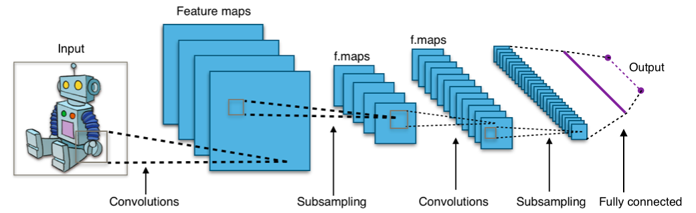
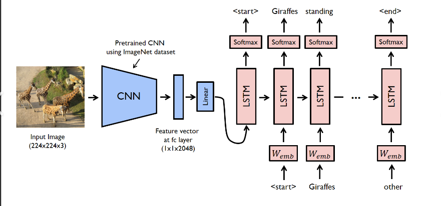

# Image Captioning Project

This project focuses on generating captions for images using a CNN-LSTM model. The dataset used is the Flickr 8k dataset. The following steps outline the process:

## Steps for Final Project:

1. **Importing Necessary Packages**
   - Loaded all required libraries and modules for data handling, model building, and training. This includes TensorFlow, Keras, NumPy, and other essential packages.

2. **Loading the Dataset**
   - Downloaded the Flickr 8k dataset, which contains 8,000 images and five captions per image. The dataset is split into training and testing sets.

3. **Text Preprocessing**
   - Clean and preprocess the text data to prepare it for model training. This includes:
     - Tokenization: Splitting captions into words.
     - Removing special characters and punctuation.
     - Converting all text to lowercase.

4. **Extracting Feature Vectors from Images**
   - Uses a pre-trained Convolutional Neural Network (CNN) model,I had used Xception to extract feature vectors from the images.By taking out the last layer of output
   - 

5. **Tokenizing the Vocabulary**
   - Tokenize the captions to create a vocabulary of unique words. Convert each word to a numerical index and vice versa. This step is crucial for feeding the text data into the model.

6. **Created Data Generator**
   - Build a data generator to efficiently feed the model with batches of images and corresponding captions during training. This helps in handling large datasets without loading everything into memory at once.

7. **CNN-LSTM Model**
   - Construct the image captioning model by combining the CNN for image feature extraction and the LSTM for sequence prediction. The architecture typically includes:
     - A CNN model to process images and extract features.
     - An embedding layer to convert word indices to dense vectors.
     - An LSTM layer to process the sequence of words.
     - A dense layer to predict the next word in the sequence.
      
## Getting Started

1. Clone the repository:
   ```bash
   git clone <repository-url>
   cd image-captioning-project
   ```

2. Install the required packages:
   ```bash
   pip install -r requirements.txt
   ```

3. Download the Flickr 8k dataset from [Flickr 8k Dataset](https://forms.illinois.edu/sec/1713398) and place it in the appropriate directory.

4. Run the project:u can run the first part of code,and last two part of codes for just testing the model since i had loaded the model from custom_model.keras in Final_code.ipynb,if you want to train the model along with extraction of features u can change the directories regarding data sets and work on them .
## Acknowledgments

- [Flickr 8k Dataset](https://forms.illinois.edu/sec/1713398)
- TensorFlow and Keras libraries
- [work flow](https://docs.google.com/document/d/14ToQIyN-T8oaZ8jZlYMXsmq2_VaRVwfuDRtqFrmfAc4/edit?usp=sharing)
